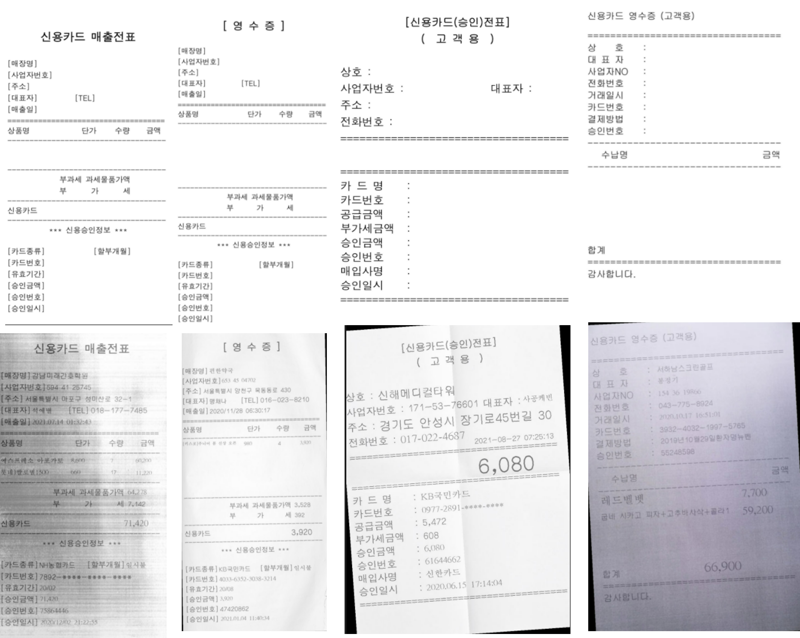
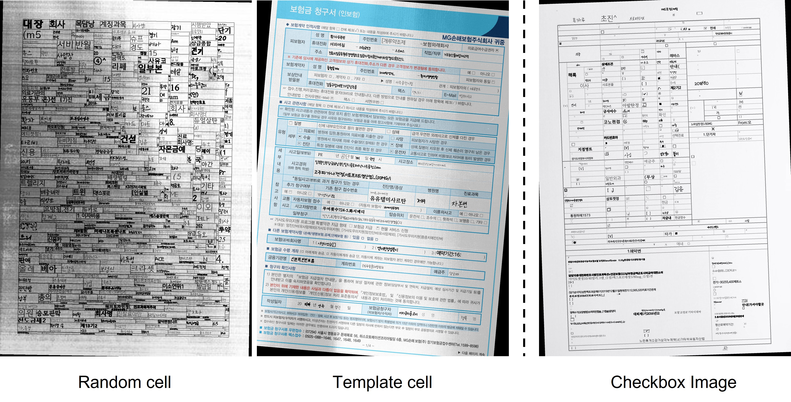

# DocGenerator(Document Generation Tool)

```
There's no plan for sharing project 😢
```
## Contents

  * [Documentation](#documentation)
  * [Usage](#usage)
    + [Requirements](#requirements)
  * [Config](#config)
  * [Output](#output)
    + [Structure](#structure)
    + [GT text](#gt-text)
    + [Drawing Bounding Box](#drawing-bounding-box)
    + [Error log](#error-log)
    + [Sample image](#sample-image)
  * [Maintainer](#maintainer)


## Updates

**Feb 03, 2022**: Initial Upload.   
**Feb 08, 2022**: Add Checkbox function.   
**Feb 11, 2022**: Add environment yaml.   
**Mar 30, 2022**: Add new template(ID card, Driver License, Passport).   
**Mar 31, 2022**: Add functions for sentence with spaces(like TwinReader STD)    
**Apr 14, 2022**: Add new template(Receipt)    
**Apr 25, 2022**: Cleanup template codes(synthtiger/components/corpus)   
**May 30, 2022**: Modify RECEIPT template(sorted box)   
**Jun 07, 2022**: Merge CheckBox code(by.Bazzi) / Modify crawling data(for receipt)   
**Jun 08, 2022**: Merge Cell code(by.Jin)   


## Documentation

Guide Notion [HERE]

About Cell generator algorithm [Link] 

About Checkbox generator [Link]


## Usage
### Requirements

- python >= 3.6
- libraqm   
(+)JupyterLab 동작 시, libraqm을 sudo apt로 설치 후, Pillow를 강제 업그레이드 해주면 동작 가능   

| Name | Type | Default | Description |
| ---- | ---- | ------- | ----------- |
| template | ```string``` | | Template module path |
| config | ```string``` | | Config file path |
| output | ```string``` | | Folder path to save data |
| count | ```integer``` | ```100``` | Number of data |
| worker | ```integer``` | ```1``` | Number of workers |   

```
# conda environment
$ conda env create -f environment.yaml


# pip requirments
$ pip install -r requirements.txt


# gen_black.sh 참고
$ bash ./exec/gen_black.sh   

$ python gen.py --template TEMPLATE
                --config CONFIG
                --output OUTPUT
                [--count COUNT]
                [--worker WORKER]
                
ex) python gen.py --template templates/default_black.py --config templates/default_black.yaml --output results --worker 4 --count 50
```

## Config

.yaml 파일 참고   

| Name     | Description                |
|----------|----------------------------|
| vertical | 미구현                     |
| quality  | (JPG에만 적용) 저장 퀄리티 |
| grayscale  | 흑백 이미지 설정         |
| document  | 사용할 문서 형식          |
| checkbox  | 체크박스 데이터 추가      |
| texture  | 스캔 이미지 텍스쳐 설정, 문서 회전 설정      |
| background  | 배경 이미지 설정, 전체 이미지 크기 설정   |
| corpus  | 단어를 생성할 corpus 속성, 문장 길이 자동으로 설정  |
| font  | font 종류(path), 글자 크기 자동으로 설정 |
| colormap  | Default 유지              |
| color  | Default 유지                 |
| style  | Default 유지                 |
| synth_cell  | Cell 생성 관련 옵션                 |

- vertical : (미구현)세로 글자 생성 시 사용될 예정

- quality : JPG 이미지 저장 시, quality 설정

- grayscale : Boolean type, 흑백 이미지 설정  

- checkbox : Checkbox 데이터 설정
    - flag : Boolean type, 체크박스 유무 설정
    - alpha : 체크박스가 들어갈 확률
    - ratio : CBOXT 비율 (<-> CBOXF : 1-ratio)
    - cboxt_file : CBOXT 형식(txt 포맷 by.Bazzi)
    - cboxf_file : CBOXF 형식(txt 포맷 by.Bazzi)
    - text_vs_img : CBOX의 구성 비율(실 데이터에서 추출한 Image or 텍스트)
    - extracted_cbox : 실 데이터에서 추출한 CBOX Image set 경로

- document
    - type : 문서 타입
        - MEB medical expenses bill, 진료비계산서영수증
        - MC medical certificate , 진단서- IC injury certificate, 상해진단서
        - DC death certificate, 사망진단서
        - MES medical expenses statement , 진료비 내역서
        - PRES prescription , 처방전
        - PCME payment confirmation of medical expenses, 진료비납입확인서
    - full_color : ["black", "blue"] : 문서 컬러 변경 현재는 블랙, 블루 버전 구현 완료   

- texture : Scan Image(./resources/texture 참고) 설정   
    - paths : 이미지 경로
    - counts : 이미지 개수
    - alpha : texture 이미지와 document 이미지 합성 시 비율
    - rot : texture 이미지 회전 범위(Degree 기준)
    - rotation : texture 이미지 회전 확률
    - pil_filter : 이미지 전체에 PIL Filter를 적용할 확률


- corpus : 생성될 단어 설정
    - paths : 문장에 사용할 word list 명시
    - weights : paths와 weight list 길이는 같아야 함
    - min_length : 문장 최소길이
    - max_length : 문장 최대길이(후보 bbox 사이즈(w/h)에 따라 자동 문장 길이 설정, synthtiger/component/length_augmentable_corpus.py )
    - textcase, augmentation, augmentation_length : default 유지

- font : 
    - paths : 폰트 경로
    - weights : paths list 길이와 같아야 함
    - size : 폰트 크기 (후보 bbox의 사이즈(h)에 따라 자동 폰트 크기 설정, synthtiger/component/font/base_font.py )
    - bold : 폰트 굵기 설정

- synth_cell : only Random Cell 생성 시에만 적용(templates/random_cell_black.yaml)
    - base_shape : 기본 이미지 사이즈
    - left/right/top/bottom margin : 상하좌우 margin 사이즈
    - cell_size : 기본 grid cell 크기(pixel length)
    - vertical_prob : 가로 순서 셀 생성 확률(=세로 셀 생성 경향)
    - horizontal_prob : 세로 순서 셀 생성 확률(=가로 셀 생성 경향)
    - min/max_cell_width : 각 single cell이 갖는 최대 grid cell 가로 길이
    - min/max_cell_height : 각 single cell이 갖는 최대 grid cell 세로 길이
    - line_thickness : Grid Cell 라인 두께
    - visualize
    - enable_color
    - save_dir

- colormap, color, style : 현재 default 유지

## Output

### Structure
```
gts/
    DC/
        gt_0.txt
        gt_1.txt
        ...
    PCME/
    ...
    MEB/
    MES/
    
images/
    DC/
        0.jpg
        1.jpg
        ...
        9998.jpg
        9999.jpg
    PCME/
    ...
    MEB/
    MES/
```

### GT text   

The format of `gt.txt` is as follows. Image path and label are separated by tab.   
(`<x1>\t<y1>\t<x2>\t<y2>\t<x3>\t<y3>\t<x4>\t<y4>\t<label>\t<Key-value Label>`)   

GT(bounding box)정보는 아래와 같이 tab으로 구분된다.   
```
927	259	1184	273	1180	349	923	335	레비신정(레보플록	value.medicine   
```

### Drawing Bounding Box   

tools 폴더 내 generate_poly_image.ipynb 참고   


### Sample image

   
   
   


## Maintainer
R&D 조정센터-알고리즘 팀/제이
제품개발본부-머신비전 팀/진
제품개발본부-머신비전 팀/배찌

+) This repo used CLOVA AI SynthTIGER | [Paper](https://arxiv.org/abs/2107.09313) | [Documentation](https://clovaai.github.io/synthtiger/)

