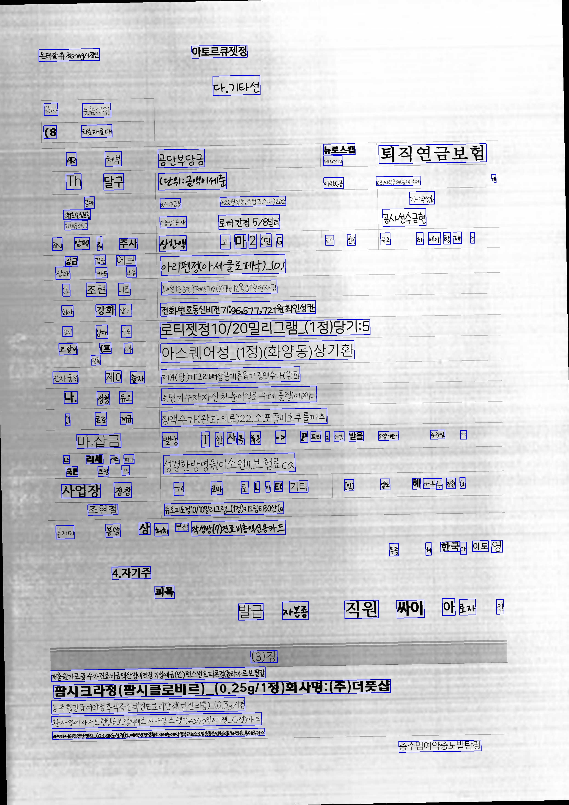
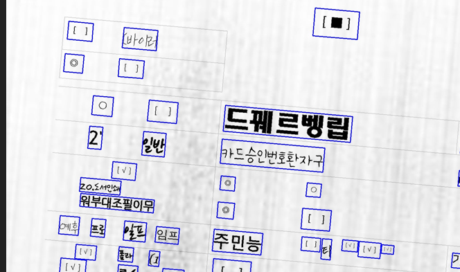

# DocGenerator(Document Generation Tool)
### There's no plans to release the code :(

## Contents

  * [Documentation](#documentation)
  * [Usage](#usage)
    + [Requirements](#requirements)
  * [Config](#config)
  * [Output](#output)
    + [Structure](#structure)
    + [GT text](#gt-text)
    + [Drawing Bounding Box](#drawing-bounding-box)
    + [Sample image](#sample-image)
  * [Maintainer](#maintainer)


## Updates

**Feb 03, 2022**: Initial Upload.   
**Feb 08, 2022**: Add Checkbox function.   
**Feb 11, 2022**: Add environment yaml.

## Documentation

Notion

## Usage
### Requirements

- python >= 3.6
- libraqm   
(+)JupyterLab 동작 시, libraqm을 sudo apt로 설치 후, Pillow를 강제 업그레이드 해주면 동작 가능   

| Name | Type | Default | Description |
| ---- | ---- | ------- | ----------- |
| template | ```string``` | | Template module path |
| config | ```string``` | | Config file path |
| output | ```string``` | | Folder path to save data |
| count | ```integer``` | ```100``` | Number of data |
| worker | ```integer``` | ```1``` | Number of workers |   

```
# conda environment
$ conda env create -f environment.yaml


# pip requirments
$ pip install -r requirements.txt


# gen_black.sh 참고

$ python gen.py --template TEMPLATE
                --config CONFIG
                --output OUTPUT
                [--count COUNT]
                [--worker WORKER]
                
ex) python gen.py --template templates/default_black.py --config templates/default_black.yaml --output results --worker 4 --count 50
```

## Config

.yaml 파일 참고   

| Name     | Description                |
|----------|----------------------------|
| vertical | 미구현                     |
| quality  | (JPG에만 적용) 저장 퀄리티 |
| grayscale  | 흑백 이미지 설정         |
| document  | 사용할 문서 형식          |
| checkbox  | 체크박스 데이터 추가      |
| texture  | 스캔 이미지 텍스쳐 설정     |
| corpus  | 단어를 생성할 corpus 속성, 문장 길이 자동으로 설정  |
| font  | font 종류(path), 글자 크기 자동으로 설정 |
| colormap  | Default 유지              |
| color  | Default 유지                 |
| style  | Default 유지                 |

- vertical : (미구현)세로 글자 생성 시 사용될 예정

- quality : JPG 이미지 저장 시, quality 설정

- grayscale : Boolean type, 흑백 이미지 설정  

- checkbox : Checkbox 이미지(./resources/cbox_image 참고) 설정
    - flag : Boolean type, 체크박스 유무 설정
    - alpha : 체크박스가 들어갈 확률
    - ratio : CBOXT 비율 (<-> CBOXF : 1-ratio)

- document
    - MEB medical expenses bill, 진료비계산서영수증
    - MC medical certificate , 진단서- IC injury certificate, 상해진단서
    - DC death certificate, 사망진단서
    - MES medical expenses statement , 진료비 내역서
    - PRES prescription , 처방전
    - PCME payment confirmation of medical expenses, 진료비납입확인서
    
- texture : Scan Image(./resources/texture 참고) 설정   
    - paths : 이미지 경로
    - counts : 이미지 개수
    - alpha : texture 이미지와 document 이미지 합성 시 비율
    - rot : texture 이미지 회전 범위(Degree 기준)
    - rotation : texture 이미지 회전 확률
    - pil_filter : 이미지 전체에 PIL Filter를 적용할 확률


- corpus : 생성될 단어 설정
    - paths : 문장에 사용할 word list 명시
    - weights : paths와 weight list 길이는 같아야 함
    - min_length : 문장 최소길이
    - max_length : 문장 최대길이(후보 bbox 사이즈(w/h)에 따라 자동 문장 길이 설정, synthtiger/component/length_augmentable_corpus.py )
    - textcase, augmentation, augmentation_length : default 유지

- font : 
    - paths : 폰트 경로
    - weights : paths list 길이와 같아야 함
    - size : 폰트 크기 (후보 bbox의 사이즈(h)에 따라 자동 폰트 크기 설정, synthtiger/component/font/base_font.py )
    - bold : 폰트 굵기 설정

- colormap, color, style : 현재 default 유지

## Output

### Structure
```
gts/
    DC/
        gt_0.txt
        gt_1.txt
        ...
    PCME/
    ...
    MEB/
    MES/
    
images/
    DC/
        0.jpg
        1.jpg
        ...
        9998.jpg
        9999.jpg
    PCME/
    ...
    MEB/
    MES/
```

### GT text   

The format of `gt.txt` is as follows. Image path and label are separated by tab.   
(`<x1>\t<y1>\t<x2>\t<y2>\t<x3>\t<y3>\t<x4>\t<y4>\t<label>`)   

GT(bounding box)정보는 아래와 같이 tab으로 구분된다.   
```
927	259	1184	273	1180	349	923	335	레비신정(레보플록
```

### Drawing Bounding Box   

results 폴더 내 generate_poly_image.ipynb 참고

### Sample image




## Maintainer
R&D 조정센터-알고리즘팀/제이

+) This repo used CLOVA AI SynthTIGER | [Paper](https://arxiv.org/abs/2107.09313) | [Documentation](https://clovaai.github.io/synthtiger/)
